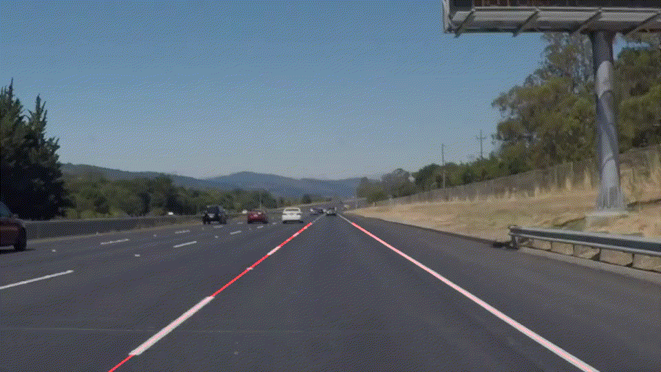
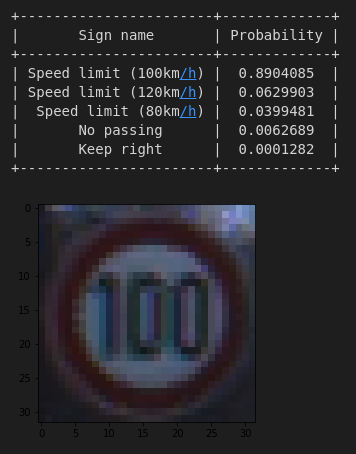
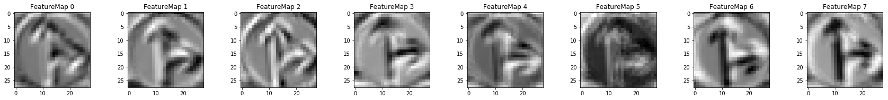
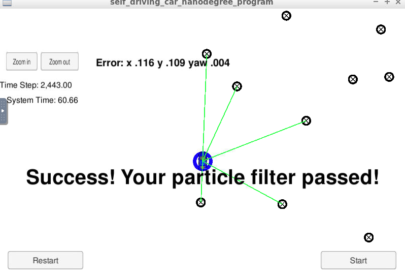

# Udacity Self-Driving Car Engineer Nanodegree

In this repo you can find my implementation of projects from Udacity Self-Driving Car Engineer Nanodegree.

## Overview

### Lane line detection
Road lane line detection using OpenCV in Python (Canny Edge detection, Hough transform).

  

---

### Advanced lane line detection
Road lane line detection using OpenCV in Python (camera calibration, distortion correction, converting to binary image with Sobel operator, birds-eye view transform, fitting second-degree polynomial).

  

---

### Traffic sign classifier
Traffic sign classification using CNN implemented in Tensorflow (data preprocessing, designing model architecture).

  
  

---

### Behavioral cloning
End-to-end Deep Learning approach to control car's steering angle based on images from cameras (training CNN with a demonstration of center-line driving, data augmentation, Keras).

  

---

### Extended Kalman Filter
KF and EKF implementation for estimating the state of a moving object based on noisy lidar and radar measurements (C++, Eigen).

---

### Particle filter
Particle Filter implementation for estimating the position of the robot based on landmark map, landmark detections and robot's control information (C++).

  

---

### Path planning
This project consisted of two parts: Behavior Planner - controlling the car's speed and changing lanes to overtake other cars and Trajectory Planner - using splines to create a smooth trajectory based on sparse path points (C++).

  

---

### PID
PID controller for controlling the car's steering angle and throttle (C++).

  

---

### Capstone
Generating trajectory with desired speeds and sending controls to the simulated car (ROS).

  

