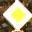

# **Traffic Sign Recognition** 

**Build a Traffic Sign Recognition Project**

The goals / steps of this project are the following:
* Load the data set
* Explore, summarize and visualize the data set
* Design, train and test a model architecture
* Use the model to make predictions on new images
* Analyze the softmax probabilities of the new images
* Summarize the results with a written report


[//]: # (Image References)

[image1]: ./writeup_images/histogram.png "Histogram"
[image2]: ./sign_images/img14.png "Traffic Sign 1"
[image3]: ./sign_images/img16.png "Traffic Sign 2"
[image4]: ./sign_images/img18.png "Traffic Sign 3"
[image5]: ./sign_images/img6.png "Traffic Sign 4"
[image6]: ./sign_images/img7.png "Traffic Sign 5"

[image7]: ./writeup_images/vis.png "Visualization"
[image8]: ./writeup_images/vis2.png "Visualization"
[image9]: ./writeup_images/vis3.png "Visualization"
[image10]: ./writeup_images/vis4.png "Visualization"
[image11]: ./writeup_images/vis5.png "Visualization"

Project is implemented in the `p3_traffic_sign_classifier.ipynb`.

## Data Set Summary & Exploration

### 1. Summary of the data set

I used the numpy library and `len` function to calculate summary statistics of the traffic
signs data set:

* The size of training set is 34799
* The size of the validation set is 4410
* The size of test set is 12630
* The shape of a traffic sign image is (32, 32, 3)
* The number of unique classes/labels in the data set is 43

### 2. Exploratory visualization of the dataset.

Here is graph representing distibution of different sign types among sets. Class distibution isn't uniform and it is clearly visible that for some cases there are much more examples. It could be correlated to the fact that on the road it is more likely to see some signs than the other. Although between training, validation and testing sets it seems that this proportion is maintained and each one looks like scaled version of the other. 

![alt text][image1]

## Design and Test a Model Architecture

### 1. Data preprocessing

As a preprocessing I used only normalization:
```
X_train = (X_train-128.)/128.
X_valid = (X_valid-128.)/128.
X_test = (X_test-128.)/128.
```
Normalized values in image are in [-1,1) range. It helps with convergence in optimization - we want our data to have zero mean and equal variance so the problem is well conditioned and numerically stable. 
I didn't use grayscale transformation, because it will cause losing some important color information, which helps in sign recognition.

#### 2. Model architecture

My final model consists of the following layers:

| Layer         		|     Description	        					| 
|:---------------------:|:---------------------------------------------:| 
| Input         		| 32x32x3 RGB image   							| 
| Convolution 5x5     	| 1x1 stride, valid padding, outputs 28x28x8 	|
| RELU					|												|
| Convolution 5x5     	| 1x1 stride, valid padding, outputs 24x24x16 	|
| RELU					|												|
| Convolution 5x5     	| 1x1 stride, valid padding, outputs 20x20x32 	|
| RELU					|												|
| Convolution 5x5     	| 1x1 stride, valid padding, outputs 16x16x64 	|
| RELU					|												|
| Convolution 5x5     	| 1x1 stride, valid padding, outputs 12x12x128 	|
| RELU					|												|
| Max pooling	      	| 2x2 stride, same padding, outputs 6x6x128     |
| Flatten   	      	| outputs 4608                                  |
| Fully connected		| outputs 800        							|
| Fully connected		| outputs 400        							|
| Fully connected		| outputs 200        							|
| Fully connected		| outputs 43        							|
| Softmax				|           									|
 


#### 3. Training model

To train the model, I used an Adam Optimizer from TensorFlow. I left batch size at 128 and learning rate at 0.001. I increased epochs size to 18, it was benefitial with larger network. Although it depended on run, sometimes performence was increasing until the end, sometimes it could slightly degrade at the end. 

#### 4. Approach


For experiments I created python script, which used Keras to create models (*projectKeras.py*). It allowed me for faster prototyping, for example final model took only 12 lines of code:
```
model = Sequential()
model.add(Conv2D(filters=8, kernel_size=5, padding="valid", activation='relu', input_shape=(32,32,3)))
model.add(Conv2D(filters=16, kernel_size=5, padding="valid", activation='relu'))
model.add(Conv2D(filters=32, kernel_size=5, padding="valid", activation='relu'))
model.add(Conv2D(filters=64, kernel_size=5, padding="valid", activation='relu'))
model.add(Conv2D(filters=128, kernel_size=5, padding="valid", activation='relu'))
model.add(MaxPooling2D(pool_size=(2,2)))
model.add(Flatten())
model.add(Dense(800, activation='relu'))
model.add(Dense(400, activation='relu'))
model.add(Dense(200, activation='relu'))
model.add(Dense(43, activation='softmax'))
```

Initially I started with LeNet architecture, which gave me around 0.914 in validation and 0.905 in testing. 

In first tests I tried inserting additional fully connected layer, which already gave improvement to about 0.92 - 0.93. I wasn't able to get much better results with more fully connected layer so I tried adding more convolutional layer. It did get better, but grow in parameters wasn't really good with respect to results and it was quite hard to push it even few percents more. I used only one pooling layer, so that not much information is lost and I could use more convolutional layers. 

Finally there was some difference between training (about 0.99) validation (about 0.96-0.97) and final results (about 0.96), so I think that network may overfit, but not that much. I did some testing with dropout layer but didn't make a big difference, so I didn't pursue it further. 

My final model results were:
* training set accuracy of 0.998
* validation set accuracy of 0.971
* test set accuracy of 0.953

### Test a Model on New Images

#### 1. Five new German traffic signs

Here are five German traffic signs that I found on the web:





They shouldn't be very difficult to classify, although there are some changes in lightning: *priority road* sign is very bright and *Speed limit* is darker. Also *No passing for vehicles over 3.5 metric tons* is quite blurry.

#### 2. Predictions

Here are the results of the prediction:

| Image			        |     Prediction	        					| 
|:---------------------:|:---------------------------------------------:| 
| No passing for vehicles over 3.5 metric tons 	| No passing   				| 
| Go straight or right     	| Go straight or right 							|
| Yield					    | Yield											|
| Priority road	      		| Priority road					 				|
| Speed limit (100km/h)		| Speed limit (100km/h)      					|


The model was able to correctly guess 4 of the 5 traffic signs, which gives an accuracy of 80%. It only mistaken *No passing for vehicles over 3.5 metric tons* for *No passing*, which is quite similar sign. I was training this model few times and this results also were sometimes different. Usually I got 1.0 or 0.8 result. Another mistake that happened sometimes was *Speed limit*. Sometimes model predicted different value of it. Compering to test results (0.953), it should perform better, but this five signs are quite small group. 

#### 3. Probabilities

First image:
|                  Sign name                   | Probability |
|:---------------------:|:---------------------------------------------:| 
|                  No passing                  |  0.9858481  |
|                Slippery road                 |  0.0140574  |
| No passing for vehicles over 3.5 metric tons |  0.0000763  |
|              Beware of ice/snow              |  0.0000178  |
|    Right-of-way at the next intersection     |  0.0000004  |

Here model made mistake. Correct sign name is present though (*No passing for vehicles over 3.5 metric tons*), but with very low probability of 0.0000763.

Second image:
|                  Sign name                   | Probability |
|:---------------------:|:---------------------------------------------:| 
|     Go straight or right    |  1.0000000  |
|      End of no passing      |  0.0000000  |
|          No passing         |  0.0000000  |
|          Road work          |  0.0000000  |
| Dangerous curve to the left |  0.0000000  |
The model is very certain about this prediction and other probabilities are below 0.0000001

Third image:
|                  Sign name                   | Probability |
|:---------------------:|:---------------------------------------------:| 
|        Yield         |  1.0000000  |
| Speed limit (30km/h) |  0.0000000  |
|      No passing      |  0.0000000  |
|      Keep right      |  0.0000000  |
|      Road work       |  0.0000000  |
Here also model is very certain about prediction and other probabilities are below 0.0000001

Fourth image:
|                  Sign name                   | Probability |
|:---------------------:|:---------------------------------------------:| 
|            Priority road            |  1.0000000  |
| End of all speed and passing limits |  0.0000000  |
|              No passing             |  0.0000000  |
|          End of no passing          |  0.0000000  |
|         Speed limit (80km/h)        |  0.0000000  |
Same as before.

Fifth image:
|                  Sign name                   | Probability |
|:---------------------:|:---------------------------------------------:| 
| Speed limit (100km/h) |  0.8904085  |
| Speed limit (120km/h) |  0.0629903  |
|  Speed limit (80km/h) |  0.0399481  |
|       No passing      |  0.0062689  |
|       Keep right      |  0.0001282  |
Model is quite sure that limit is 100 km/h, other limits here are also present, as they appeal similar, but with low probabilities.

### Visualizing the Neural Network


For visualization I used *Go straight or right* sign.

First layer:
![alt text][image7]
In first layer it looks like edges are selected. Although FeatureMap 5 looks different and was probably activated by white color.

Second layer:
![alt text][image8]
Third layer:
![alt text][image9]
Second and third layer seems to be focused more on general look of arrows

Fourth layer:
![alt text][image10]
Fifth layer:
![alt text][image11]
Fourth and fifth layer looks a little more abstract and it is hard for me to tell from visualizations what exactly their activation depends on.


